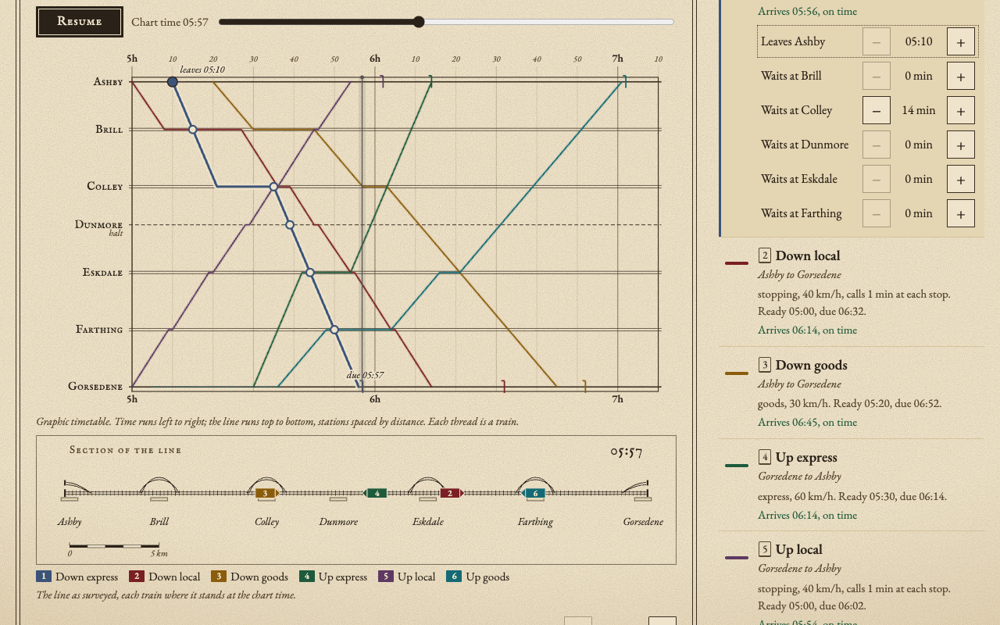

# Single Track

A timetable puzzle: run trains on one track without a collision.



The line is drawn as a **Marey diagram**, the graphic timetable of the 1880s
(the famous Paris–Lyon chart is one): time runs left to right, the stations
run down the side spaced by their real distance, and every train is an ink
thread. A steep thread is a fast train; a flat stretch is a train waiting at a
station. On a single-track line two trains can only meet or overtake where
there is a passing loop, so the whole puzzle is visible at a glance: wherever
two threads cross between stations, there is a collision.

## The 30-second experience

1. Open a plate. The starting timetable always has at least one conflict,
   marked on the chart with a small red cross-hatch and listed in plain words
   underneath ("Head-on: Down local and Up local meet between Brill and Colley
   at 06:11").
2. Drag a thread sideways to change when that train leaves, or drag one of
   its round knobs to make it wait longer at a station. Conflicts update as
   you drag. Every train card (and the bar under the drawings) has − / +
   steppers that do the same thing.
3. When the status line says **Line clear**, press **Run**. The page brings
   the chart and the survey drawing under it into view together; a time
   cursor sweeps across the chart while the trains, as numbered ink blocks,
   move along the surveyed line. A clean run presses an inspection stamp onto
   the chart with your total waiting against the plate's par, and a link on
   to the next plate.
4. **Share timetable** copies a link to your solution (for example
   `…#p1/0.3-3.0`) and shows it, so anyone can open it and press Run.
   Opening a link loads it as one undo step, so it never wipes out work in
   progress, and the address goes back to the bare plate so Back and Forward
   only switch plates. Someone else's timetable counts toward your own record
   only once you change it.

Thirteen hand-designed plates climb gently: a first meeting at a loop, choosing
between loops, a halt where trains cannot pass, overtaking, three trains, a
loop's two-track limit, trains that must call at every station, short
workings that run only part of the line, and finally six trains on seven
stations.

### Rules the game enforces

- A train occupies a section of single track from the moment it leaves one
  station until it reaches the next. Two trains may never share a section at
  the same time. Opposite directions is a **head-on** conflict; the same
  direction is a **rear-end** conflict (so overtaking is only possible at a
  station).
- A station holds as many trains at once as it has tracks: a **halt** (dashed
  rule) has one, a **loop** (double rule) two, a **yard** three. Too many is a
  **crowded** conflict. Trains start from and finish in sidings, so a train at
  its own origin or destination does not count.
- At a station, a train holds its track from the minute it arrives to the
  minute it leaves, **both included**, while sections use zero headway (a
  train may enter a section the minute another leaves it). The difference is
  deliberate: at a single-track halt, a train arriving in the same minute
  another departs would need the one platform road at the same moment, so a
  swap there takes at least a minute; a section, by contrast, is clear once
  the train ahead has reached the next station.
- Every train has a time it is ready to leave, a deadline at its destination,
  a speed (express 60 km/h, stopping 40, goods 30; section times are rounded
  up to whole minutes), and sometimes a minimum call at each station.
- **Waiting** is every minute a train spends beyond its earliest start and
  its required calls. **Par** is **proven optimal for plates I–VIII**: an
  exhaustive check (`npm run prove`) tries every timetable with less waiting
  than par, and none of them solves the plate. For **plates IX–XIII** par is
  heuristic: the least waiting the design-time branch-and-bound search in
  `tools/par-search/` found, so it may be beatable; the stamp says so when you
  do.
- A **move** is one adjustment of one knob. Nudging the same knob again
  straight away continues the same move, so dragging a departure twelve
  minutes, or pressing → twelve times, is one move and one undo step.

### Keys

The first Tab stop is a **Skip to the chart** link. The plates are a single
Tab stop: `←` `→` (or `Home`, `End`) move between them and `Enter` opens one.
On the chart: `1`–`6` pick a train, `←` `→` adjust the selected knob by a
minute (`Shift` for five), `↑` `↓` move between that train's stations,
`Enter` runs. `Ctrl`/`⌘`+`Z` undoes and `Ctrl`/`⌘`+`Shift`+`Z` (or
`Ctrl`+`Y`) redoes, from anywhere on the page.

With **reduced motion** set, Run does not animate the trains: the cursor steps
ten minutes at a time and the survey drawing redraws at each step, and the
page jumps to the chart instead of scrolling smoothly. A theme left on
automatic follows the system's light or dark setting as it changes.

## Why Elm

The whole game is a pure function of a small immutable value, and Elm is
built for exactly that.

- `src/Rail.elm` is the model and the rules: running times, the schedule a
  timetable implies, conflict detection (with the exact crossing point of two
  threads for the mark), deadlines, waiting and validation. It has no effects
  at all.
- `src/History.elm` is undo and redo in a few dozen lines. Because every game state
  is an immutable value, a history is just two stacks either side of the
  present one; nothing is copied or diffed.
- `src/Game.elm` combines the two: the move counting and the rule that
  repeated nudges of one knob are a single undo step.
- `src/Share.elm` turns timetables into link fragments and back, with every
  number checked against the plate.
- `src/Levels.elm` is the level data, typed Elm records.
- `src/Chart.elm` and `src/Survey.elm` draw the Marey diagram and the survey
  drawing as SVG; `src/Main.elm` wires everything to the browser.

The compiler's exhaustive checking of custom types (`HeadOn | RearEnd |
Crowded`, `Departure | Dwell n`) did real work while the rules changed during
design. Besides the compiled Elm, the only JavaScript in the page is
`web/glue.js` (about ninety lines: flags, localStorage, the clipboard,
reduced-motion and colour-scheme changes, scrolling the chart into view,
pointer capture and the theme attribute), plus the few lines of
`web/boot.js` that apply a saved theme before first paint.

Separately, the design-time tools in `tools/par-search/` are JavaScript for
Node and never ship in the page: `rules.mjs` mirrors the rules, `search.mjs`
finds each plate's par, `prove.mjs` proves it optimal for plates I–VIII,
`emit.mjs` writes the plates into Elm, and `mirror.mjs` writes an Elm test
that checks the mirror and `src/Rail.elm` agree.

## Build and test

Requirements: Node 20 or newer. The Elm compiler, elm-test and terser are
pinned dev dependencies (`elm` 0.19.1-6, `elm-test` 0.19.1-revision17,
`terser` 5.44.1). The first build downloads the Elm packages listed in
`elm.json` into the Elm package cache (`~/.elm`, or `$ELM_HOME`).

```sh
npm ci
npm run build      # dist/: index.html, hashed assets, _headers, notices
npm test           # elm-test, then build, then the end-to-end checks
npm run prove      # exhaustive proof that par is optimal on plates I–VIII
npm run serve      # serve dist/ on a free local port
```

`npm test` runs:

- **elm-test** (159 tests): head-on, rear-end (including where the mark goes
  when the threads never cross), overtaking and meeting at a loop, touching
  times, halts, loop capacity, origins and destinations, arrival times and
  deadlines, knob bounds, validation, positions; every plate's known solution
  is valid, conflict-free and on time, its waiting equals the plate's par,
  and the starting timetable is not already solved; share links round-trip
  (fuzzed over every plate) and hostile links are refused; undo, redo, move
  counting and reset; a shared timetable loads as one undo step and stops
  being "shared" at the player's first move; and the JavaScript mirror of the
  rules agrees with `src/Rail.elm` on 741 timetables (each plate's par
  solution, small nudges of it, and random ones).
- **Node checks** against the built `dist/`: the page references hashed
  assets that exist, the headers are right, the third-party notices cover
  every bundled package, WCAG contrast of the colour tokens in both themes,
  every pair of train inks clearly different (CIEDE2000 of 15 or more), the
  level data and mirror cases match the design tools, the par proof for
  plates I–IV, and the local server behaves.
- **Headless Chrome** (over the DevTools protocol): no console errors; the
  keyboard, a real pointer drag, undo and redo; Run with and without reduced
  motion, with the chart and the survey drawing both inside a 1280×800 and a
  1440×900 window while plates I, IX and XIII run, and the stamp and its
  next-plate link in view at the end; a solve by hand is remembered and an
  untouched shared one is not; every plate's known solution loaded from a
  link; a link opened over work in progress is undoable, and Back after a
  link never replaces later work; bad and enormous links; the share button;
  the skip link and the one-stop plate list; the theme toggle and following
  a change of system theme; and every plate at a true 400 px phone width
  with no sideways scrolling. If Chrome is not found these are skipped
  locally; set `REQUIRE_BROWSER=1` to make that a failure, or `CHROME_PATH`
  to point at a browser.

To re-run the par search: `node tools/par-search/search.mjs` then
`node tools/par-search/emit.mjs` (the tests check the Elm files match). To
prove par for plates I–VIII: `npm run prove` (about 12 seconds; it tries all
15,312,644 timetables with less waiting than par and finds none that works). Plates IX–XIII have far too many such timetables for this (plate IX
alone has about 6 × 10¹⁰), so their par stays heuristic.

## Running on Cloudflare (free)

It is a static site. `npm run build` produces `dist/` (seven files, about
116 KB before compression), deployable to **Cloudflare Pages** with no Worker
and no storage. The Pages free tier serves static assets with unlimited
requests, up to 20,000 files per site and 25 MiB per file, so this fits with
room to spare. Progress and the theme choice live in the visitor's own
browser (localStorage); the game sends nothing anywhere. The only
third-party request is the typefaces, fetched from Google Fonts.

`dist/_headers` sets a strict Content-Security-Policy (scripts only from the
site itself; styles and fonts from Google Fonts) and a one-year immutable
cache only for the content-hashed files under `/assets/`.

To deploy your own copy: `npm run build`, then
`npx wrangler pages deploy dist --project-name single-track`. This repository
deliberately has no deploy script and no `account_id`; the owner deploys
through a separate guarded script so the right account is always used.

## Honest limitations

- **Par is proven only for plates I–VIII.** There, every timetable with less
  waiting has been tried and fails. For plates IX–XIII par is the least
  waiting a branch-and-bound search found; that search allows at most one
  overtake per pair of trains and handles crowded loops with a bounded number
  of extra constraints, so those pars are achievable (the tests check) but
  may be beatable. The proof runs on the JavaScript mirror of the rules,
  which a test checks against the Elm rules on 741 timetables rather than
  proving the two identical.
- **The railway is simplified.** Trains are points with constant speed, no
  acceleration or braking, whole minutes, and zero headway: a train may enter a
  section the minute another leaves it. Lines, stations, speeds and times are
  invented.
- **Thirteen plates, one line each.** There is no level editor yet.
- **Dragging on a phone is coarse.** At 400 px a minute is about two pixels;
  the steppers are the precise way to edit there.
- **The chart is visual.** Keyboard users can do everything, and the conflict
  log, train cards and knob bar give the same information in text, but a
  screen reader hears a summary of the graph rather than the graph itself.
- **Fonts come from Google Fonts** at run time; if that is blocked the page
  falls back to local serif faces.
- **Copying the share link** uses the Clipboard API; where that is refused the
  link is shown for copying by hand. The automated tests check the link, not
  the clipboard.
- **Progress is per browser.** There is no account and no server.

## Next

- A leaderboard of least waiting and fewest moves per plate (Cloudflare D1).
- A level editor, and shareable user-made plates.
- More lines: junctions, double-track sections, and trains that reverse.
- A proven par for plates IX–XIII, which needs a smarter exact search than
  trying every timetable (for example a solver over meeting orders).

## Credits and licence

Built by Ramen Protocol with AI assistance (Claude). MIT licence, see
`LICENSE`. The built site bundles the Elm core packages (BSD-3-Clause); their
notices ship as `dist/THIRD-PARTY-NOTICES.txt` and are linked from the page
footer. The typefaces, EB Garamond and IM FELL English SC, are loaded from
Google Fonts under the SIL Open Font License.
